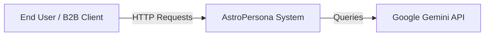

# 01. Architecture Overview - AstroPersona

## 1. Introduction
AstroPersona is a premium, personalized horoscope application designed to deliver high-precision astronomical calculations combined with advanced, AI-enhanced interpretations. The system is architected to be modular, scalable, and testable, adhering to modern software engineering standards suitable for production environments.

## 2. Architectural Pattern
We will adopt a **Modular Monolith** architecture with **Clean Architecture** principles.
- **Why Modular Monolith?** It allows for rapid development and simplified deployment (single Docker container initially) while keeping domains strictly separated. This makes the future transition to Microservices trivial if scaling requires it.
- **Why Clean Architecture?** It ensures that the core domain logic (astronomy rules) remains independent of frameworks (FastAPI), databases, or external interfaces (AI providers).

## 3. High-Level Design (C4 Model)

### 3.1 System Context
The user interacts with the AstroPersona API via a client application (Web/Mobile) or directly as a B2B integration.



### 3.2 Container Diagram
The system is composed of the following distinct logical containers (modules):

```mermaid
graph TD
    Client[Client App] -->|HTTPS| API[API Gateway / Controller Layer]
    
    subgraph "AstroPersona Application"
        API --> Service[Service Layer]
        
        subgraph "Core Domain"
            Service --> AstroEng[Astro Engine (Math)]
            Service --> InterpEng[Interpretation Engine (Rules)]
        end
        
        subgraph "Infrastructure / Adapters"
            Service --> AISvc[AI Service Adapter]
            Service --> Repo[Persistence Adapter]
            Service --> Cache[Cache Adapter]
        end
    end
    
    AstroEng -->|Uses| SwissEph[Swiss Ephemeris Lib]
    AISvc -->|API Call| Gemini[Google Gemini API]
    Repo -->|SQL| DB[(PostgreSQL)]
    Cache -->|TCP| Redis[(Redis)]
```

## 4. Key Components

### 4.1 Astro Engine (Core Domain)
*   **Responsibility**: Pure mathematical calculations using `pyswisseph`.
*   **Characteristics**: Deterministic, stateless, high precision.
*   **Inputs**: Timestamp, Latitude, Longitude.
*   **Outputs**: Planet positions (Sign, Degree), Houses, Aspects.

### 4.2 Interpretation Engine (Core Domain)
*   **Responsibility**: Translating mathematical data into semantic meaning based on astrological rules.
*   **Characteristics**: Rule-based, extensible.
*   **Pattern**: Strategy Pattern or Rule Engine for mapping planetary configurations to text keys (e.g., `SUN_LEO_HOUSE_5`).

### 4.3 AI Service (Infrastructure)
*   **Responsibility**: Generating natural language narratives from semantic tokens.
*   **Characteristics**: Asynchronous, failure-tolerant (circuit breaker pattern).
*   **Integration**: Uses **Google Gemini API** for high-quality, context-aware generation. Prompts are constructed using data from the Interpretation Engine.

### 4.4 Persistence & Caching
*   **Database**: PostgreSQL for storing user profiles and generated reports.
*   **Cache**: Redis for caching heavy astronomical calculations (optional for v1, recommended for scale) and rate limiting.

## 5. Technology Stack

| Component | Technology | Rationale |
|-----------|------------|-----------|
| **Language** | Python 3.11+ | Native support for `pyswisseph`, strong AI ecosystem (LangChain, etc.), robust web frameworks. |
| **Web Framework** | FastAPI | High performance (ASGI), auto-documentation (OpenAPI), strict typing (Pydantic). |
| **Astro Library** | pyswisseph | The gold standard for astrological precision. |
| **Database** | PostgreSQL | Robust, relational, supports JSONB for flexible report storage. |
| **Containerization** | Docker | Standard for deployment and environment consistency. |
| **Testing** | Pytest | Industry standard for Python testing. |
| **Linting/Formatting** | Ruff | High-speed linting. |

## 6. Scalability & Performance
*   **Stateless API**: The application layer is stateless, allowing horizontal scaling behind a load balancer.
*   **Caching Strategy**:
    *   **L1 Cache**: In-memory (LRU) for frequently accessed static data (e.g., rule definitions).
    *   **L2 Cache**: Redis for calculation results keyed by (Lat, Long, Time) rounded to minutes, to avoid re-calculating for same birth times.
*   **Async I/O**: Leveraging `asyncio` for non-blocking calls to the AI provider and Database.